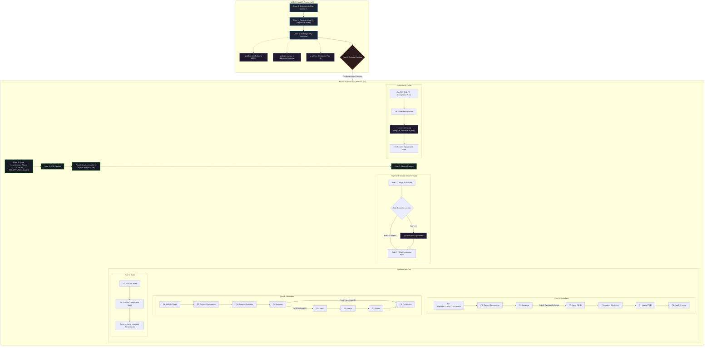

# q-agent — Master Project Orchestrator

> **Hermetic deployment package v01** · Tool-agnostic · Greenfield · Brownfield · Audit

---

## What is q-agent?

`q-agent` is a master orchestrator for full software development cycles. It is NOT a code generator — it is a **conductor**: it guides the user through the right questions, makes architectural decisions using specialized skills, and delegates technical execution to the correct runtime.

Every decision is **traceable as a GitHub Issue** in the project repository. Every step produces a documented artifact committed to Git.

### Path Resolution & Execution Boundary
- **`<SKILL_ROOT>`**: Directory where `q-agent` is installed (e.g. `~/.pi/agent/skills/q-agent/`). All internal orchestrator assets (`prompts/`, `templates/`, `references/`, `skills/`) are always resolved relative to `<SKILL_ROOT>`.
- **`<PROJECT_ROOT>`**: Active target workspace repository (`cwd`). All project source code, Git branches, and generated artifacts (`CONSTITUTION.md`, `CLAUDE.md`, `openspec/`, `docs/adr/`) are created inside `<PROJECT_ROOT>`.

### Compatible runtimes
| Runtime | How to activate |
|---------|----------------|
| **Pi** | `pi chat --skill q-agent` or say "start agent" |
| **Antigravity CLI** | Load skill, then say "start agent" |
| **Claude Code** | SKILL.md is auto-detected via frontmatter |
| **OpenCode** | Load skill directory |

---

## Package Directory Structure

```text
q-agent-v01/
├── SKILL.md                          # Orquestador canónico (Pasos 0 a 7)
├── README.md                         # Documentación del paquete
├── tutorial.html                     # Guía interactiva visual
├── references/                       # Referencias operativas internas
│   ├── plans.md                      # Mapeo por plan (A/B/C) con OpenSpec
│   ├── claude-md-template.md         # Plantilla CLAUDE.md para repos nuevos
│   └── issue-labels.md               # Taxonomía de etiquetas GitHub Issues
├── prompts/                          # Prompts ejecutables del SDD Pipeline
│   ├── P01_auditoria_mab_pc.md       # Discovery & Audit (MAB-PC)
│   ├── P02_context_engineering.md    # Viabilidad técnica y Hexagonal Ligera
│   ├── P03_evolucion_blueprint.md    # Reconciliación V1 vs V2
│   ├── P04_propose.md                # Gate de Scope (/propose) + Fast-Track
│   ├── P04b_constitution_sync.md     # Sincronización continua de Drift y ADRs
│   ├── P05_spec.md                   # Especificación BDD con Given/When/Then
│   ├── P06_design.md                 # Diseño técnico y contratos de interfaces
│   ├── P07_tasks.md                  # Desglose de tareas TDD atómicas
│   ├── P08_apply_verify.md           # Implementación TDD y verificación de stack
│   └── P09_compliance_audit.md       # CAB-RP unificado (inmutabilidad, CodeGraph, anti-mock)
├── templates/                        # Artefactos canónicos (estándar MAYÚSCULAS)
│   ├── ADR.md                        # Architecture Decision Record
│   ├── BLUEPRINT.md                  # Mapa arquitectónico del sistema
│   ├── CONSTITUTION.md               # Reglas no negociables y tabla de ADRs
│   └── PROPOSAL.md                   # Estructura del /propose (IN/OUT scope)
└── skills/                           # Skills auxiliares (planas, prefijo q-)
    ├── q-grill-me/                   # Elicitación profunda y socrática (Plan A)
    ├── q-deliberate/                 # Debate dialéctico y cristalización de ADRs
    ├── q-delegate-context/           # Aislamiento en sub-contexto (FirstMate)
    ├── q-gbrain-assistant/           # Consulta de memoria histórica (Engram/GBrain)
    ├── q-ci-fixer/                   # Reparación quirúrgica de CI/linters (SwarmForge)
    └── q-session-wrap/               # Cierre ordenado y persistencia de sesión
```

---

## The 3 Plans

q-agent operates under one of three plans, selected at the start of every cycle:

| Plan | Use case | Pipeline |
|------|----------|---------|
| **A — Greenfield** | New system from scratch | P0 → P2 → P4 → P5 → P6 → P7 → P8 (sync P1.5) |
| **B — Brownfield** | Feature or evolution on existing code | P1 → P2 → P3 → P4 → P5 → P6 → P7 → P8 (sync P1.5) |
| **C — Audit** | Review, audit and diagnose existing code | P1 → P9 (CAB-RP) → Issues de remediación |

---

## Operating Modes

```
Steps 0–3  → GUIDED mode      (agent asks, user responds — 1 question at a time)
Steps 4–7  → AUTONOMOUS mode  (agent executes, interrupts only at critical gates)
```

### The 3 ONLY reasons to interrupt after Step 3
1. The `/propose` scope (P4) needs explicit approval before continuing
2. An architectural decision has two symmetric tradeoffs (no clear winner)
3. A blocking error that requires context the agent doesn't have

Everything else → the agent decides, records the rationale in a GitHub Issue, and continues.

---

## Architectural Flow Diagram



---

## Step-by-step Walkthrough

### Step 0 — Plan Identification
The agent presents the 3 plans and waits for the user's choice.
Loads `references/plans.md` to configure the exact pipeline for the selected plan.

---

### Step 1 — Initial Context (Guided)
The agent asks questions one at a time:

**All plans:**
1. Project / system name
2. Core problem it solves (1–3 lines)
3. Known technical constraints (stack, integrations, platform)

**Plan A adds:**
4. End user and main use case
5. Hardest constraint (what breaks at 3am?)
6. What is explicitly OUT of MVP scope

**Plan B adds:**
4. Repository URL or local path
5. Specific feature or change needed

**Plan C adds:**
4. Repository URL or local path
5. Specific audit criteria (or general review)

---

### Step 2 — Research (Skills invoked)

#### 2a. `q-deliberate` — Architectural Deliberation (all plans)
Multi-agent dialectical debate. Deploys 3 sub-roles internally:
- **Proponent** — builds the strongest case for each option
- **Adversary** — stress-tests risks, edge cases, failure modes
- **Synthesizer** — arbitrates and produces the recommended decision + ADR

Output: architectural brief with evaluated alternatives. Presented to user for confirmation.

#### 2b. `q-gbrain-assistant` — Historical Knowledge Query (optional, all plans)
Queries 3 knowledge sources in parallel via MCP:
- **Engram** — previous architectural decisions, similar past projects
- **GBrain** — accumulated knowledge on stacks and patterns
- **SkillVault** (`QuantumEdu/kbs`) — skills and prompts used in similar contexts

Results synthesized into a `## Historical context` block in `PROJECT_CONTEXT.md`.

#### 2c. `q-grill-me` — Deep Elicitation (Plan A only)
A relentless socratic interview to sharpen the plan scope. Surfaces hidden assumptions and trade-offs before any code is written.

All Step 2 outputs are synthesized into an internal `PROJECT_CONTEXT.md` (not delivered to user — used as context for all subsequent steps).

---

### Step 3 — Meta-Orchestration Gate (Last guided step)
The agent decides and presents:
- Single-agent or multi-agent execution?
- Recommended executor runtime (Codex CLI / Antigravity CLI / OpenCode / Pi)
- Rationale for the decision

User confirms → **autonomous mode begins**.

---

### Step 4 — Infrastructure Setup (Autonomous)

Delegates heavy sub-tasks via `q-delegate-context` (FirstMate pattern) to keep the orchestrator main thread clean.

**Plan A:**
1. Create private GitHub repository
2. Create `CLAUDE.md` at repo root (from `references/claude-md-template.md`)
3. Initialize `CONSTITUTION.md` at repo root (from `templates/CONSTITUTION.md`) with stack, domain rules, and initial ADR table
4. Verify subsystems (SkillVault, Telemetry, Engram)
5. Create initial Issues: `[SETUP]`, `[ADR-001]` (registered in Constitution), `[SCOPE] MVP`

**Plan B:**
1. Clone / verify access to existing repo
2. Verify subsystems
3. Create Issue `[FEATURE] description`
4. Setup branches: P1 to P3 executed on `develop`, P4 bifurcates to `feature/<name>`

**Plan C:**
1. Clone / verify access to repo to audit
2. Create Issue `[AUDIT] start`
3. Create branch `audit/<date>-<project>`

---

### Step 5 — Main Pipeline Flow (Autonomous)

Executes the SDD pipeline prompts in the order defined by `references/plans.md`. Standard storage path: `openspec/changes/{{CHANGE_ID}}/`.

After each prompt that produces an artifact:
```bash
git add <artifact>
git commit -m "feat: <artifact description>"
git push origin <active-branch>
```

**Fast-Track Shortcut (Nivel 1):** If P4 classifies the change as Nivel 1 (≤3 files, no Domain/DB impact), it skips P5, P6, P7 and executes directly via P8 Fast-Track.

**Mandatory P4 gate (Plans A & B):** After `/propose` completes on Nivel 2, the `proposal.md` is presented to the user with full IN/OUT scope. The user must approve before continuing.

#### SDD Pipeline Prompts

| Prompt | File | What it produces |
|--------|------|-----------------|
| **P01** | `prompts/P01_auditoria_mab_pc.md` | MAB-PC audit: `BLUEPRINT.md` + `CONSTITUTION.md` |
| **P02** | `prompts/P02_context_engineering.md` | `CONTEXT.md` — structured project context |
| **P03** | `prompts/P03_evolucion_blueprint.md` | `BLUEPRINT_V2.md` + `DIFF_V1_VS_V2.md` |
| **P04** | `prompts/P04_propose.md` | `openspec/changes/{{CHANGE_ID}}/proposal.md` — IN/OUT scope gate |
| **P05** | `prompts/P05_spec.md` | `openspec/changes/{{CHANGE_ID}}/specs/{{FEATURE}}.md` — BDD |
| **P06** | `prompts/P06_design.md` | `openspec/changes/{{CHANGE_ID}}/design.md` — architecture & contracts |
| **P07** | `prompts/P07_tasks.md` | `openspec/changes/{{CHANGE_ID}}/tasks.md` — atomic task breakdown |
| **P08** | `prompts/P08_apply_verify.md` | Verified TDD implementation + `verify-report.md` |
| **P1.5 / P04b** | `prompts/P04b_constitution_sync.md` | `CONSTITUTION.md` — Continuous sync, drift audit & ADR table |
| **P09** | `prompts/P09_compliance_audit.md` | `AUDIT_REPORT.md` — CAB-RP compliance audit |

---

### Step 6 — Implementation with Hygiene Control (Autonomous)

*(Omitido en Plan C — las auditorías diagnostican y crean Issues sin implementar código)*

#### Sub-phase A — Code implementation
Standard git workflow per feature/fix:
1. Create Issue with label `type:feature` or `type:fix`
2. Create branch from `develop`
3. Implement with descriptive commits
4. Open PR → `develop` referencing the Issue (`Closes #N`)
5. Merge on quality pass, close Issue via PR

Branch naming:
- `main` → stable production
- `develop` → continuous integration
- `feature/<name>` → new features (Plans A/B)
- `fix/<name>` → bugs
- `audit/<date>-<name>` → audits (Plan C)

#### Sub-phase B — Hygiene (SwarmForge pattern)
Executed BEFORE committing code (or against `git diff --name-only develop...HEAD` if already committed):

1. **Deterministic local check (0 tokens):** Run linters/formatters/type checks locally.
   - Exit 0 → proceed to commit. No tokens consumed.
2. **Surgical CI repair — only if exit ≠ 0:** Invoke `q-ci-fixer` on changed files ONLY (`git diff --name-only` uncommitted or `develop...HEAD`).
   - Never on the full codebase. Never for cosmetic changes.
   - **Hard cap: maximum 2 passes.** If still failing → create Issue `[CI-BLOCK]` with `priority:high` and continue.

#### Sub-phase C — Constitution & ADR Sync (`P04b_constitution_sync.md`)
Triggered when an architectural boundary is crossed, a new/replacement ADR is created, or every 7 tasks:
1. Compares cumulative `git diff` against `CONSTITUTION.md`.
2. Flags decisions as `[VIGENTE]`, `[NUEVO]`, `[DRIFT-DETECTADO]`, or `[OBSOLETO]`.
3. Updates Section 3 ADR status table (records `ADR-[NNN]` as active or `REEMPLAZADO por ADR-XXX`).
4. Invariant: ADRs are immutable — decisions are never edited in-place; a new ADR supersedes the old one.
5. Appends changes to `## SYNC LOG` and commits.

---

### Step 7 — Closure & Delivery (Autonomous)

#### 7a. Compliance Audit (CAB-RP P09)
Executes `prompts/P09_compliance_audit.md` (unifies all compliance checks):
- **Invariants:** Absolute disk immutability (`git status -s` identical before/after); CodeGraph first; Zero tolerance for fake completions (anti-mock / fake data checks).
- Evaluates: base architecture, security (OWASP Top 10), telemetry, SQLite WAL concurrency, backups, recovery.
- Outputs: `AUDIT_REPORT.md` (Traceability matrix, 9-category checklist, EARS gap specs, P0/P1 remediation plan).
- Issues created for each gap: label `type:nfr-gap` + severity.

#### 7b. Retrospective Issue
Created in the project repo with label `type:retrospective`:
- Decisions made and rationale
- Skills invoked
- Artifacts generated
- Gaps detected by CAB-RP
- Executor used
- Recommended next action

#### 7c. `q-session-wrap` — Session persistence
- Saves session memory to **Engram** (`mem_session_summary`)
- Catalogs artifacts in **SkillVault** (if available)
- Creates atomic SQLite snapshot (`VACUUM INTO`)

#### 7d. Final report
Compact summary delivered in chat:
- What was done
- Key decisions
- Open Issues
- Retrospective Issue URL
- Next step

---

## Skills Reference

### `q-grill-me`
**Step 2c — Plan A only**
A relentless structured interview to sharpen scope. Surfaces hidden assumptions and requirements before any code is written.
- Output: refined scope and elicited non-negotiables

### `q-deliberate`
**Step 2a — All plans**
Multi-agent dialectical debate engine. Three internal sub-roles (Proponent, Adversary, Synthesizer) stress-test architectural decisions before presenting frontier questions to the user.
- Proponent: builds the strongest case for each option using primary sources
- Adversary: attacks scale limits, concurrency, failure modes, maintenance burden
- Synthesizer: arbitrates, eliminates hype, produces recommended decision + ADR
- Output: architectural brief + ADRs in `docs/adr/`

### `q-delegate-context`
**Steps 4 & 5 — All plans**
Keeps the orchestrator main thread clean by delegating heavy sub-tasks to isolated sub-contexts (FirstMate pattern). Selects executor, model, and effort automatically or explicitly.
- Budgets: read ≤180s, web research ≤600s, implementation ≤900s
- Hard cap: 2 correction rounds per task
- Compatible executors: native subagents, Antigravity CLI, Codex CLI

### `q-gbrain-assistant`
**Step 2b — All plans (optional)**
Structured gateway to GBrain (Personal + Multi-Agent Knowledge Graph). Queries Engram, GBrain, and SkillVault in parallel to surface historical decisions, patterns, and lessons learned.
- Hybrid query (RRF + semantic expansion)
- Key intents: context briefing, historical decision retrieval, knowledge registration, gap analysis, health check

### `q-ci-fixer`
**Step 6 Sub-phase B — All plans**
Surgical CI/CD pipeline repair. Operates only on `git diff` files. Never weakens quality rules.
- 4-layer protocol: Format/Lint → Static Types → Business Logic Assertions → Coverage Gate
- PROHIBITED: editing `ci.yml` to lower coverage thresholds, blanket `# noqa` / `# type: ignore` suppressors
- Blast radius minimum: only essential lines to resolve the error
- Hard cap: 2 passes

### `q-session-wrap`
**Step 7c — All plans**
Ordered session closure. Persists operational memory so the next session starts with full context.
- Engram: `mem_session_summary` with Goal / Instructions / Discoveries / Accomplished / Next Steps / Relevant Files
- SkillVault (graceful fallback): session entry + artifacts
- SQLite: `VACUUM INTO` atomic snapshot

---

## Artifact Templates

| Template | File | Purpose |
|----------|------|---------|
| ADR | `templates/ADR.md` | Architecture Decision Record |
| Blueprint | `templates/BLUEPRINT.md` | System architecture map |
| Constitution | `templates/CONSTITUTION.md` | Non-negotiable rules and principles |
| Proposal | `templates/PROPOSAL.md` | `/propose` scope gate structure |

---

## References

| File | Purpose |
|------|---------|
| `references/plans.md` | Exact prompt mapping per plan A/B/C with OpenSpec paths |
| `references/claude-md-template.md` | CLAUDE.md template for new repositories |
| `references/issue-labels.md` | Complete GitHub Issue label taxonomy |

---

## Installation

### Pi (recommended)
```bash
cp -r q-agent-v01 ~/.pi/agent/skills/q-agent
pi skills list | grep q-agent
```

Activate: say **"start agent"** or **"/q-agent"** in any Pi session.

### Antigravity CLI
```bash
cp -r q-agent-v01 ~/.gemini/antigravity-cli/skills/q-agent
```

### Claude Code / OpenCode
Copy `q-agent-v01/` to your agent's skills directory. The `SKILL.md` frontmatter (`name`, `aliases`) is auto-detected.

---

## Activation Triggers

Say any of these in a session with q-agent loaded:

```
start agent · /q-agent · iniciar agente · new project
new feature · audit code · I want to build a system
```

---

## Version

`v01` — Hermetic Canonical Package.  
Author: QuantumEdu  
License: Apache-2.0
