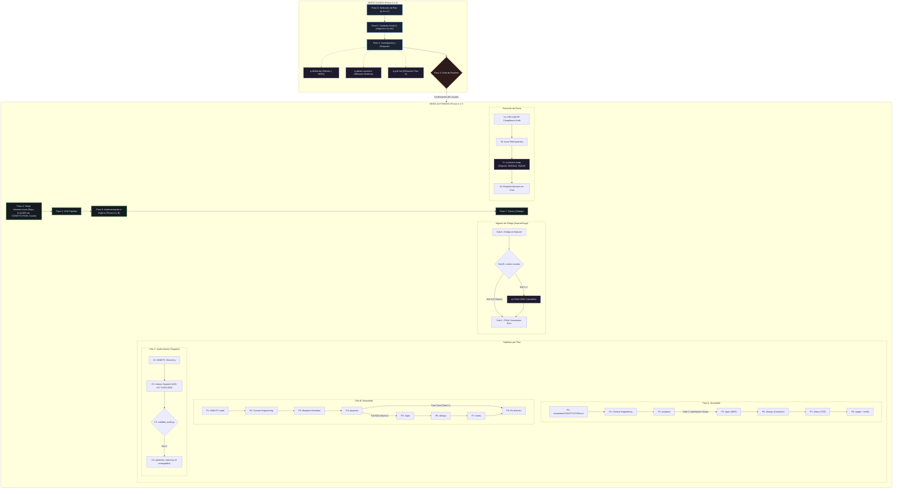

# q-agent — Master Project Orchestrator
> **Hermetic deployment package v2.3.0 (Dual Engine, Modern ODD & Wave SDD)** · Tool-agnostic · Greenfield · Brownfield · Audit

[](https://github.com/QuantumEdu/q-agent/actions/workflows/ci.yml)
[](LICENSE)
[](CHANGELOG.md)

---

## What is q-agent?

`q-agent` is a master orchestrator for full software development cycles. It is NOT a code generator — it is a **conductor**: it guides the user through the right questions, makes architectural decisions using specialized skills, and delegates technical execution to the correct runtime.

Every decision is **traceable as a GitHub Issue** in the project repository. Every step produces a documented artifact committed to Git.

### Path Resolution & Execution Boundary
- **`<SKILL_ROOT>`**: Directory where `q-agent` is installed (e.g. `~/.pi/agent/skills/q-agent/`). All internal orchestrator assets (`prompts/`, `templates/`, `references/`, `skills/`) are always resolved relative to `<SKILL_ROOT>`.
- **`<PROJECT_ROOT>`**: Active target workspace repository (`cwd`). All project source code, Git branches, and generated artifacts (`CONSTITUTION.md`, `CLAUDE.md`, `openspec/`, `docs/adr/`) are created inside `<PROJECT_ROOT>`.

### Compatible Runtimes & Registries
| Runtime / Registry | How to activate |
|--------------------|----------------|
| **skills.sh** | `npx skills add QuantumEdu/q-agent` |
| **Pi** | `pi chat --skill q-agent` or say "start agent" |
| **Antigravity CLI** | Load skill, then say "start agent" |
| **Claude Code** | SKILL.md is auto-detected via frontmatter |
| **OpenCode** | Load skill directory |

### Universal Installation & Linking
Link `q-agent` into all active AI runtimes on your machine with a single command (symlinks ensure `git pull` updates all agents instantly):

```bash
# Using just (recommended)
just install

# Or using the installer script directly
./install.sh

# Verify active links
just check  # or ./install.sh --check
```

---

## Why Deterministic SDD? (The "Amarillas" Analysis)

Current agentic coding frameworks fail in production due to structural design flaws:
1. **Vibe Coding Regressions:** Editing code without architectural constraints causes unmaintainable drift and breaks existing domain rules.
2. **Big Design Up Front (BDUF) & Context Rot (Spec-Kit):** Emitting massive Markdown specifications in a single session saturates the context window. By Phase 5, LLMs suffer attention degradation ("Lost in the Middle"), ignoring instructions and generating hallucinations ([Spec-Kit Issues #3507, #3752](https://github.com/github/spec-kit/issues/3507)).
3. **Multi-Agent Swarm Overhead (BMAD / ChatDev):** Unconstrained conversational agent swarms introduce 3x–5x token burn, high latency, and compounding hallucinations without verifiable quality gates.

`q-agent` solves these failure modes through **Single-Agent Orchestration with Deterministic Quality Gates**:

### Comprehensive Architectural Matrix

| Capability | GitHub Spec-Kit | OpenSpec | BMAD Method | Superpowers | **q-agent** |
| :--- | :--- | :--- | :--- | :--- | :--- |
| **Execution Architecture** | Waterfall BDUF (High *Context Rot* risk) | Modular, but lacks deterministic gates | Multi-agent conversational swarm (3x–5x token burn) | Fixed prompt chain, weak Brownfield support | **Single Tier-1 Orchestrator + Tier-2 local workers** |
| **Workspace Isolation** | Local working tree (high collision risk) | Manual checkout | Harness-dependent | Manual checkout | **Mandatory Git Worktrees (`../{repo}-worktrees/`)** |
| **Implementation Guarantee** | Prompt-based trust (`/speckit-converge`) | Subjective diff review | Inter-agent consensus | Direct execution | **Reproduction-First TDD (RED failure mandatory before GREEN)** |
| **Context Window Hygiene** | Dumps full Markdown specs | Injects full specification files | High chatter token burn | Rigid template injection | **AST Skeleton Compression (Prunes >70% tokens)** |
| **Human-in-the-Loop** | Agent takes full control | Agent takes full control | Opaque bot dialogues | Agent takes full control | **Supervised Gates (P03, P04, P09) + Mentor Mode** |
| **Observability / LLMOps** | None native | None native | None native | Basic logs | **Flight Recorder + 9-Dimension Evaluation Matrix** |
| **Caliber Routing** | One-size-fits-all ceremony | Manual branching | Swarm roles | Static scripts | **Calibrated Fast-Track (≤3 files) vs Full SDD vs Plan C** |


---

## Package Directory Structure

```text
q-agent-v02/
├── SKILL.md                          # Orquestador canónico (Pasos 0 a 7 + Catálogo de Prompts)
├── README.md                         # Documentación del paquete
├── install.sh                        # Universal runtime linker (AGY, Codex, Pi, Claude, OpenCode)
├── justfile                          # Automation runner recipes (install, check, test, cockpit)
├── tutorial.html                     # Guía interactiva visual completa
├── implement-future-but-not-in-this-project.md # Blueprint del agente curricular q-academic
├── references/                       # Referencias operativas internas
│   ├── plans.md                      # Mapeo por plan (A/B/C) con OpenSpec e Interaction Modes
│   ├── claude-md-template.md         # Plantilla CLAUDE.md para repos nuevos
│   ├── issue-labels.md               # Taxonomía de etiquetas GitHub Issues
│   ├── flight-recorder.md            # Protocolo de observabilidad y log de vuelo
│   └── context-budgeting.md          # Protocolo de poda de contexto y esqueletos AST
├── prompts/                          # Prompts ejecutables del SDD Pipeline
│   ├── P01_auditoria_mab_pc.md       # Discovery & Audit (MAB-PC)
│   ├── P02_context_engineering.md    # Viabilidad técnica y Hexagonal Ligera
│   ├── P03_evolucion_blueprint.md    # Reconciliación V1 vs V2
│   ├── P04_propose.md                # Gate de Scope (/propose) + Fast-Track
│   ├── P04b_constitution_sync.md     # Sincronización continua de Drift y ADRs
│   ├── P05_spec.md                   # Especificación BDD con Given/When/Then
│   ├── P06_design.md                 # Diseño técnico y contratos de interfaces
│   ├── P07_tasks.md                  # Desglose de tareas TDD atómicas + Tags Kiro
│   ├── P08_apply_verify.md           # Implementación TDD, Reproduction-First y rollback
│   └── P09_compliance_audit.md       # CAB-RP unificado (inmutabilidad, CodeGraph, anti-mock)
├── templates/                        # Artefactos canónicos (estándar MAYÚSCULAS)
│   ├── ADR.md                        # Architecture Decision Record
│   ├── BLUEPRINT.md                  # Mapa arquitectónico del sistema
│   ├── CONSTITUTION.md               # Reglas no negociables y tabla de ADRs
│   ├── PROPOSAL.md                   # Estructura del /propose (IN/OUT scope)
│   └── q-agent.json                  # Plantilla de configuración declarativa
├── tools/                            # Herramientas secundarias de apoyo
│   ├── q-checklist/                  # Matriz de decisiones rápidas de pre-vuelo (CLI TUI)
│   └── q-cockpit/                    # Cockpit visual interactivo (Grill UI + Observabilidad SwarmForge)
└── skills/                           # Skills auxiliares (planas, prefijo q-)
    ├── q-grill-me/                   # Elicitación profunda y socrática (Plan A)
    ├── q-deliberate/                 # Debate dialéctico y cristalización de ADRs
    ├── q-delegate-context/           # Aislamiento en sub-contexto (FirstMate)
    ├── q-gbrain-assistant/           # Consulta de memoria histórica (Engram/GBrain)
    ├── q-ci-fixer/                   # Reparación quirúrgica de CI/linters (SwarmForge)
    └── q-session-wrap/               # Cierre ordenado y persistencia de sesión
```

---

## The 3 Plans

q-agent operates under one of three plans, selected at the start of every cycle:

| Plan | Use case | Pipeline |
|------|----------|---------|
| **A — Greenfield** | New system from scratch | P0 → P2 → P4 → P5 → P6 → P7 → P8 (sync P1.5) |
| **B — Brownfield** | Feature or evolution on existing code | P1 → P2 → P3 → P4 → P5 → P6 → P7 → P8 (sync P1.5) |
| **C — Audit** | Review, audit and diagnose existing code | P01 → Atomic Dispatch (`audit-manifest.yml`) → `validate_audit.py` (Exit 0) → `generate_report.py` |

---

## Operating Modes & Interaction Governance

`q-agent` supports 3 operational interaction modes configurable via `.q-agent.json` (`runtime.interaction_mode`) or via the prompt:

1. **`supervised` (Default / Recommended):**
   - Autonomous execution on mechanical phases (P06, P07, P08).
   - Mandatory human-in-the-loop stopping gates at critical architectural points:
     - **Gate P03 (Evolution/ADR):** Validates design tradeoffs before writing specs.
     - **Gate P04 (Scope/Proposal):** User approves IN/OUT scope and caliber classification.
     - **Gate P09 (Compliance/Release):** User approves branch merge into `main`.
2. **`interactive` / Mentor Mode (User at the Wheel):**
   - The agent acts purely as an architectural mentor, guiding phase by phase without modifying code autonomously.
   - *Prompt:* `"Quiero ejecutar el flujo SDD manualmente paso a paso. No implementes nada por tu cuenta. Actúa únicamente como mi Mentor Arquitectónico: indícame en cada turno qué prompt o fase sigue, explícame el objetivo conceptual y entrégame la plantilla con las variables que debo completar. Yo tendré el volante."`
3. **`autonomous` (CI/CD & Headless):**
   - End-to-end execution without prompts, ideal for unattended pipelines.

### 💡 Ready-to-Use Operational Prompts Catalog

#### 🎓 Mentor Mode (User at the Wheel):
> *"Quiero ejecutar el flujo SDD manualmente paso a paso. No implementes nada por tu cuenta. Actúa únicamente como mi Mentor Arquitectónico: indícame en cada turno qué prompt o fase sigue, explícame el objetivo conceptual y entrégame la plantilla con las variables que debo completar. Yo tendré el volante."*

#### 1. Greenfield (Plan A — New System from Scratch):
> *"Inicia un proyecto Greenfield con q-agent para construir un sistema de [nombre_sistema, ej: MeetSync registro de reuniones y acuerdos] con arquitectura hexagonal y SQLite. Guíame en los pasos iniciales y genera la Constitución y primer ADR."*

#### 2. Brownfield (Plan B — Feature on Existing Codebase):
> *"Ejecuta Plan B Brownfield en este repositorio para añadir el feature de [descripción_feature, ej: Dashboard de cumplimiento con exportación a Markdown]. Realiza el descubrimiento previo P01, actualiza a BLUEPRINT_V2 y coordina el cambio SDD."*

#### 3. Fast-Track (Plan B Nivel 1 — Surgical Patch / Micro-Fix):
> *"Aplica un cambio Fast-Track para solucionar el bug de [descripción_bug, ej: timeout por concurrencia en SQLite]. Ejecuta la fase roja obligatoria, verifica el fallo del test reproductor y aplica el fix quirúrgico en ≤3 archivos sin tocar el dominio."*

#### 4. Audit / Plan C (Read-Only Compliance & Gap Analysis):
> *"Ejecuta una auditoría Plan C en este repositorio bajo el protocolo MAB-PC y CAB-RP. Invariante estricto: no modifiques ningún archivo de código fuente. Inspecciona arquitectura, seguridad y persistencia, y genera la lista de issues EARS de remediación."*


---

## Advanced Determinism & Isolation Protocols

### 1. Workspace Isolation (Git Worktrees)
- Prevents the agent from altering dirty workspaces or switching active branches in the developer's IDE.
- Created at `../{repo}-worktrees/{branch}`.
- Worktrees are cleanly removed upon PR merge (`git worktree remove`).

### 2. Reproduction-First TDD (SWE-agent Pattern)
- Strict red-phase invariant: Editing `src/` is strictly forbidden until an automated test in `tests/` reproduces the failure (exit code $\neq 0$).
- Recorded as `[REPRODUCTION] [RED_FAIL]` and verified as `[REPRODUCTION] [GREEN_PASS]` in `.q-agent/flight_recorder.log`.
- Deterministic rollback: 3 consecutive test failures trigger atomic reset (`git checkout -- .`) and `[ROLLBACK] [EXECUTED]`.

### 3. Context Budgeting & AST Skeletons
- In projects with >10k LOC, the agent prunes function bodies, extracting only AST skeletons (interfaces, class definitions, method signatures).
- Conserves ~80% of tokens while preserving 100% of architectural context.
- Documented in `references/context-budgeting.md`.

### 4. Kiro-Style Task Gating
- Tasks in `openspec/changes/{{CHANGE_ID}}/tasks.md` support dual scoping:
  - `- [ ] [CORE] [TDD] ...` (Executed mandatory in `/apply`).
  - `- [ ] [OPTIONAL:DISABLED] ...` (Ignored by the agent unless toggled by the user to `[OPTIONAL:ENABLED]`).

### 5. Pre-Flight Decision Matrix (`tools/q-checklist/`)
- A zero-dependency interactive CLI (`python tools/q-checklist/q_checklist.py`) to choose architecture, database, transport, testing, and isolation in under 2 minutes.
- Auto-generates `CONSTITUTION.md`, `docs/adr/0001-stack-decisions.md`, and `.q-agent.json`.

### 6. BMAD Squad Path Lens in P04 (Product Management)
- Enriches Nivel 2 proposals in `P04_propose.md` with a structured **Product Manager** perspective:
  - User Personas and real business friction points.
  - Formal Agile User Stories: `Como [rol], quiero [capacidad], para [beneficio tangible]`.
  - User Acceptance Criteria (UAC) and business value hypotheses before touching technical specs.

### 7. LLMOps Evaluation Matrix (9 Dimensions)
Configurable in `.q-agent.json` via `observability.eval_level` according to project scale:
- **`minimal`**: Measures `final outcome` (tests pass) and `policy compliance` (domain isolation). Ideal for micro-fixes and prototypes.
- **`standard` (Default)**: Tracks 7 dimensions: `decision`, `evidence`, `tools`, `routing`, `retries`, `policy compliance`, and `final outcome`.
- **`enterprise`**: Activates all 9 dimensions, adding granular `cost` (token consumption) and `latency` (wall-clock seconds per phase) for enterprise SLAs and audits.

---

## Architectural Flow Diagram



---

## Step-by-step Walkthrough

### Step 0 — Plan Identification
The agent presents the 3 plans and waits for the user's choice.
Loads `references/plans.md` to configure the exact pipeline for the selected plan.

---

### Step 1 — Initial Context (Guided)
The agent asks questions one at a time:

**All plans:**
1. Project / system name
2. Core problem it solves (1–3 lines)
3. Known technical constraints (stack, integrations, platform)

**Plan A adds:**
4. End user and main use case
5. Hardest constraint (what breaks at 3am?)
6. What is explicitly OUT of MVP scope

**Plan B adds:**
4. Repository URL or local path
5. Specific feature or change needed

**Plan C adds:**
4. Repository URL or local path
5. Specific audit criteria (or general review)

---

### Step 2 — Research (Skills invoked)

#### 2a. `q-deliberate` — Architectural Deliberation (all plans)
Multi-agent dialectical debate. Deploys 3 sub-roles internally:
- **Proponent** — builds the strongest case for each option
- **Adversary** — stress-tests risks, edge cases, failure modes
- **Synthesizer** — arbitrates and produces the recommended decision + ADR

Output: architectural brief with evaluated alternatives. Presented to user for confirmation.

#### 2b. `q-gbrain-assistant` — Historical Knowledge Query (optional, all plans)
Queries 3 knowledge sources in parallel via MCP:
- **Engram** — previous architectural decisions, similar past projects
- **GBrain** — accumulated knowledge on stacks and patterns
- **SkillVault** (`QuantumEdu/kbs`) — skills and prompts used in similar contexts

Results synthesized into a `## Historical context` block in `PROJECT_CONTEXT.md`.

#### 2c. `q-grill-me` — Deep Elicitation (Plan A only)
A relentless socratic interview to sharpen the plan scope. Surfaces hidden assumptions and trade-offs before any code is written.

All Step 2 outputs are synthesized into an internal `PROJECT_CONTEXT.md` (not delivered to user — used as context for all subsequent steps).

---

### Step 3 — Meta-Orchestration Gate (Last guided step)
The agent decides and presents:
- Single-agent or multi-agent execution?
- Recommended executor runtime (Codex CLI / Antigravity CLI / OpenCode / Pi)
- Rationale for the decision

User confirms → **autonomous mode begins**.

#### Model Tier Routing Matrix
q-agent separates execution by cognitive capability rather than proprietary vendor lock-in:

| Tier | Capability Profile | Primary Models | Assigned Lifecycle Steps |
|------|--------------------|----------------|--------------------------|
| **Tier 1 (Frontier / High-Reasoning)** | Deep architectural deliberation, complex constraint adherence, spec design, and strict compliance audits. | **Gemini 3.8 Flash** / Gemini Pro<br>**GPT-6 Astra** / GPT-5.6 Sol | **Step 2:** Deliberation & Grill-Me (`q-deliberate`, `q-grill-me`)<br>**Step 5:** Spec & Design Contracts (P05, P06)<br>**Step 7:** CAB-RP Compliance Audit (P09) |
| **Tier 2 (Fast / Local Execution)** | Deterministic coding, test suite execution, syntax/type error patching, and zero-latency linter hygiene. | **Qwen 2.5 (3B / 7B ROCm)**<br>Gemini Flash-Lite / GPT-5.6 Luna | **Step 6:** Linters & Hygiene (`q-ci-fixer`)<br>**Step 8:** Atomic TDD tasks & parches<br>**Fast-Track:** Nivel 1 atomic patches via `q-delegate-context` |

*Architectural Principle:* Never run heavy compliance audits (P09) on models < 14B. Always delegate mechanical lint repairs and single-test failures to Tier 2 (local Qwen on ROCm or Flash-Lite) to eliminate latency and token waste.

> **Declarative Configuration:** If `<PROJECT_ROOT>/.q-agent.json` exists, `q-agent` automatically loads the target runtime executor and model tiers without interactive prompting. See `templates/q-agent.json`.


---

### Step 4 — Infrastructure Setup (Autonomous)

Delegates heavy sub-tasks via `q-delegate-context` (FirstMate pattern) to keep the orchestrator main thread clean.

**Plan A:**
1. Initialize Flight Recorder at `<PROJECT_ROOT>/.q-agent/flight_recorder.log` (records preflight checks, boundary resolutions, and milestone transitions; see `references/flight-recorder.md`)
2. Initialize `.q-agent.json` from `templates/q-agent.json` if not already present
3. Create private GitHub repository (`gh repo create <name> --private`)
4. Create `CLAUDE.md` at repo root (from `references/claude-md-template.md`, compatible with Claude Code, Antigravity, and Codex)
5. Initialize `CONSTITUTION.md` at repo root (from `templates/CONSTITUTION.md`) with stack, domain rules, and initial ADR table
6. Verify subsystems (SkillVault, Telemetry, Engram)
7. Create initial Issues: `[SETUP]`, `[ADR-001]` (registered in Constitution), `[SCOPE] MVP`

**Plan B:**
1. Clone / verify access to existing repo
2. Ensure `.q-agent/flight_recorder.log` is active for audit tracking
3. Verify subsystems
4. Create Issue `[FEATURE] description`
5. Setup branches: P1 to P3 executed on `develop`, P4 bifurcates to `feature/<name>`

**Plan C:**
1. Clone / verify access to repo to audit
2. Ensure `.q-agent/flight_recorder.log` is active for audit tracking
3. Create Issue `[AUDIT] start`
4. Create branch `audit/<date>-<project>`


---

### Step 5 — Main Pipeline Flow (Autonomous)

Executes the SDD pipeline prompts in the order defined by `references/plans.md`. Standard storage path: `openspec/changes/{{CHANGE_ID}}/`.

After each prompt that produces an artifact:
```bash
git add <artifact>
git commit -m "feat: <artifact description>"
git push origin <active-branch>
```

**Fast-Track Shortcut (Nivel 1):** If P4 classifies the change as Nivel 1 (≤3 files, no Domain/DB impact), it skips P5, P6, P7 and executes directly via P8 Fast-Track.

**Mandatory P4 gate (Plans A & B):** After `/propose` completes on Nivel 2, the `proposal.md` is presented to the user with full IN/OUT scope. The user must approve before continuing.

#### SDD Pipeline Prompts

| Prompt | File | What it produces |
|--------|------|-----------------|
| **P01** | `prompts/P01_auditoria_mab_pc.md` | MAB-PC audit: `BLUEPRINT.md` + `CONSTITUTION.md` |
| **P02** | `prompts/P02_context_engineering.md` | `CONTEXT.md` — structured project context |
| **P03** | `prompts/P03_evolucion_blueprint.md` | `BLUEPRINT_V2.md` + `DIFF_V1_VS_V2.md` |
| **P04** | `prompts/P04_propose.md` | `openspec/changes/{{CHANGE_ID}}/proposal.md` — IN/OUT scope gate |
| **P05** | `prompts/P05_spec.md` | `openspec/changes/{{CHANGE_ID}}/specs/{{FEATURE}}.md` — BDD |
| **P06** | `prompts/P06_design.md` | `openspec/changes/{{CHANGE_ID}}/design.md` — architecture & contracts |
| **P07** | `prompts/P07_tasks.md` | `openspec/changes/{{CHANGE_ID}}/tasks.md` — atomic task breakdown |
| **P08** | `prompts/P08_apply_verify.md` | Verified TDD implementation + `verify-report.md` |
| **P1.5 / P04b** | `prompts/P04b_constitution_sync.md` | `CONSTITUTION.md` — Continuous sync, drift audit & ADR table |
| **P09** | `prompts/P09_compliance_audit.md` | `AUDIT_REPORT.md` — CAB-RP compliance audit |

---

### Step 6 — Implementation with Hygiene Control (Autonomous)

*(Omitido en Plan C — las auditorías diagnostican y crean Issues sin implementar código)*

#### Sub-phase A — Code implementation
Standard git workflow per feature/fix:
1. Create Issue with label `type:feature` or `type:fix`
2. Create branch from `develop`
3. Implement with descriptive commits
4. Open PR → `develop` referencing the Issue (`Closes #N`)
5. Merge on quality pass, close Issue via PR

Branch naming:
- `main` → stable production
- `develop` → continuous integration
- `feature/<name>` → new features (Plans A/B)
- `fix/<name>` → bugs
- `audit/<date>-<name>` → audits (Plan C)

#### Sub-phase B — Hygiene (SwarmForge pattern)
Executed BEFORE committing code (or against `git diff --name-only develop...HEAD` if already committed):

1. **Deterministic local check (0 tokens):** Run linters/formatters/type checks locally.
   - Exit 0 → proceed to commit. No tokens consumed.
2. **Surgical CI repair — only if exit ≠ 0:** Invoke `q-ci-fixer` on changed files ONLY (`git diff --name-only` uncommitted or `develop...HEAD`).
   - Never on the full codebase. Never for cosmetic changes.
   - **Hard cap: maximum 2 passes.** If still failing → create Issue `[CI-BLOCK]` with `priority:high` and continue.

#### Sub-phase C — Constitution & ADR Sync (`P04b_constitution_sync.md`)
Triggered when an architectural boundary is crossed, a new/replacement ADR is created, or every 7 tasks:
1. Compares cumulative `git diff` against `CONSTITUTION.md`.
2. Flags decisions as `[VIGENTE]`, `[NUEVO]`, `[DRIFT-DETECTADO]`, or `[OBSOLETO]`.
3. Updates Section 3 ADR status table (records `ADR-[NNN]` as active or `REEMPLAZADO por ADR-XXX`).
4. Invariant: ADRs are immutable — decisions are never edited in-place; a new ADR supersedes the old one.
5. Appends changes to `## SYNC LOG` and commits.

---

### Step 7 — Closure & Delivery (Autonomous)

#### 7a. Compliance Audit (Atomic Dispatch & CAB-RP)
Executes the **Atomic Dispatch Protocol** via `references/audit-manifest.yml`:
- **Invariants:** Absolute disk immutability (`git status -s` identical before/after); Zero mixed mode (no touching `src/` or `internal/` during audit); CodeGraph first; Anti-mocking verification.
- **Atomic Dispatch:** Generates atomic item files in `audit/A*.md` (A01-A17) and `audit/E*.md` (E01-E05) via specialist prompts (`P01b_audit_item.md`, `P01c_strategic_item.md`).
- **Mechanical Validation Gate:** Executes `python3 tools/q-audit-validator/validate_audit.py --mode manifest --level [0|1|2]` (Exit code 0 mandatory before proceeding).
- **Deterministic Aggregation:** Executes `python3 tools/q-audit-aggregator/generate_report.py` to auto-assemble `AUDIT_REPORT.md`, `PLAN_DE_MEJORA.md`, `REMEDIATION_ISSUES.md`, and `PROPUESTA_EVOLUTIVA.md` with zero token burn.

#### 7b. Retrospective Issue
Created in the project repo with label `type:retrospective`:
- Decisions made and rationale
- Skills invoked
- Artifacts generated
- Gaps detected by CAB-RP
- Executor used
- Recommended next action

#### 7c. `q-session-wrap` — Session persistence
- Saves session memory to **Engram** (`mem_session_summary`)
- Catalogs artifacts in **SkillVault** (if available)
- Creates atomic SQLite snapshot (`VACUUM INTO`)

#### 7d. Final report
Compact summary delivered in chat:
- What was done
- Key decisions
- Open Issues
- Retrospective Issue URL
- Next step

---

## Skills Reference

### `q-grill-me`
**Step 2c — Plan A only**
A relentless structured interview to sharpen scope. Surfaces hidden assumptions and requirements before any code is written.
- Output: refined scope and elicited non-negotiables

### `q-deliberate`
**Step 2a — All plans**
Multi-agent dialectical debate engine. Three internal sub-roles (Proponent, Adversary, Synthesizer) stress-test architectural decisions before presenting frontier questions to the user.
- Proponent: builds the strongest case for each option using primary sources
- Adversary: attacks scale limits, concurrency, failure modes, maintenance burden
- Synthesizer: arbitrates, eliminates hype, produces recommended decision + ADR
- Output: architectural brief + ADRs in `docs/adr/`

### `q-delegate-context`
**Steps 4 & 5 — All plans**
Keeps the orchestrator main thread clean by delegating heavy sub-tasks to isolated sub-contexts (FirstMate pattern). Selects executor, model, and effort automatically or explicitly.
- Budgets: read ≤180s, web research ≤600s, implementation ≤900s
- Hard cap: 2 correction rounds per task
- Compatible executors: native subagents, Antigravity CLI, Codex CLI

### `q-gbrain-assistant`
**Step 2b — All plans (optional)**
Structured gateway to GBrain (Personal + Multi-Agent Knowledge Graph). Queries Engram, GBrain, and SkillVault in parallel to surface historical decisions, patterns, and lessons learned.
- Hybrid query (RRF + semantic expansion)
- Key intents: context briefing, historical decision retrieval, knowledge registration, gap analysis, health check

### `q-ci-fixer`
**Step 6 Sub-phase B — All plans**
Surgical CI/CD pipeline repair. Operates only on `git diff` files. Never weakens quality rules.
- 4-layer protocol: Format/Lint → Static Types → Business Logic Assertions → Coverage Gate
- PROHIBITED: editing `ci.yml` to lower coverage thresholds, blanket `# noqa` / `# type: ignore` suppressors
- Blast radius minimum: only essential lines to resolve the error
- Hard cap: 2 passes

### `q-session-wrap`
**Step 7c — All plans**
Ordered session closure. Persists operational memory so the next session starts with full context.
- Engram: `mem_session_summary` with Goal / Instructions / Discoveries / Accomplished / Next Steps / Relevant Files
- SkillVault (graceful fallback): session entry + artifacts
- SQLite: `VACUUM INTO` atomic snapshot

---

## Artifact Templates

| Template | File | Purpose |
|----------|------|---------|
| ADR | `templates/ADR.md` | Architecture Decision Record |
| Blueprint | `templates/BLUEPRINT.md` | System architecture map |
| Constitution | `templates/CONSTITUTION.md` | Non-negotiable rules and principles |
| Proposal | `templates/PROPOSAL.md` | `/propose` scope gate structure |

---

## References

| File | Purpose |
|------|---------|
| `references/plans.md` | Exact prompt mapping per plan A/B/C with OpenSpec paths |
| `references/claude-md-template.md` | CLAUDE.md template for new repositories |
| `references/issue-labels.md` | Complete GitHub Issue label taxonomy |

---

## Installation

### Registry: skills.sh (Universal / 1-line install)
```bash
npx skills add QuantumEdu/q-agent
```

### Pi (Recommended)
```bash
cp -r q-agent-v02 ~/.pi/agent/skills/q-agent
pi skills list | grep q-agent
```

Activate: say **"start agent"** or **"/q-agent"** in any Pi session.

### Antigravity CLI
```bash
cp -r q-agent-v02 ~/.gemini/antigravity-cli/skills/q-agent
```

### Claude Code / Cursor / OpenCode
Copy `q-agent-v02/` to your agent's skills directory. The `SKILL.md` frontmatter (`name`, `aliases`) is auto-detected.

---

## Activation Triggers

Say any of these in a session with q-agent loaded:

```
start agent · /q-agent · iniciar agente · new project
new feature · audit code · I want to build a system
```

---

## Ecosystem & Discoverability Tags (GitHub Topics)

For open-source indexing and discoverability across developer communities:

```text
specification-driven-development · sdd · tdd-framework · llmops · clean-architecture
git-worktree · agentic-workflows · ast-parsing · claude-code-skill · antigravity-agent
code-audit · zero-dependencies · skills-sh
```

---

## Contributing & Quality Standards

We welcome issues, feedback, and pull requests! Please read our [CONTRIBUTING.md](CONTRIBUTING.md) guide for details on:
- Issue taxonomy and labels (`type:*`, `priority:*`, `scope:*`).
- Git branching strategy (`develop` -> `feature/*` -> `main`).
- Article ARQ-01 guidelines and Zero-Mock Terminal Evidence requirements.
- Running the local validation suite (`python3 -m unittest discover -s tests -v`).

---

## Version, Author & License

- **Version:** `v02` (2.3.0) — Hermetic Canonical Package (Dual Engine, Modern ODD, Wave SDD, Deploy Gate, Ops Bridge, Visual Cockpit & CI Pipeline).
- **Author & Architect:** Gabriel Magallón Sánchez / QuantumEdu (Quantum).
- **License:** [Apache License 2.0](LICENSE).
- **Contributing:** See [CONTRIBUTING.md](CONTRIBUTING.md).
- **Attribution & Third-Party Credits:** See [ATTRIBUTION.md](ATTRIBUTION.md) for full acknowledgments of third-party foundations and Quantum's original skills.
