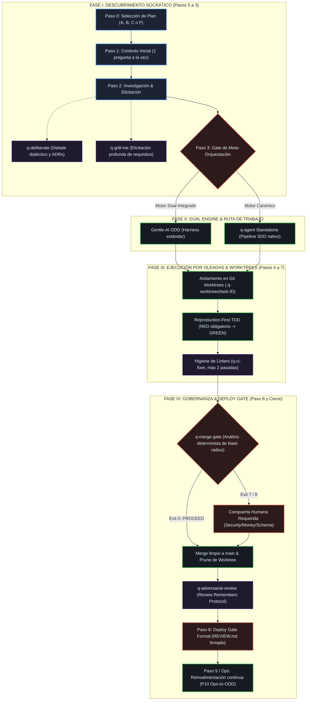

# q-agent — Master Project Orchestrator
> **Hermetic deployment package v2.6.1 (Dual Engine, Vertical Slices & Wave Execution)** · Tool-agnostic · Greenfield · Brownfield · Fast-Track · Audit

[](https://github.com/QuantumEdu/q-agent/actions/workflows/ci.yml)
[](LICENSE)
[](CHANGELOG.md)

---

## 1. Fundamentos & Visión Arquitectónica

### ¿Qué es q-agent?
`q-agent` es un **director de orquesta** para el ciclo de vida completo de ingeniería de software asistida por IA. No es un generador de código que escupe archivos sin control (*vibe coding*): es un **árbitro arquitectónico** que guía el contexto mediante preguntas socráticas, delimita fronteras de dominio inmutables, hace cumplir el **Artículo Constitucional ARQ-01** (Vertical Slices) y delega la ejecución a herramientas deterministas y compuertas de calidad no negociables.

Toda decisión queda registrada en Git y es trazable como un GitHub Issue. Cada entrega técnica genera evidencia observable en terminal con **cero mocks**.

### Por qué SDD Determinista: El Análisis "Amarillas"
Los frameworks contemporáneos de agentes autónomos fallan en producción debido a tres vicios estructurales:
1. **Regresiones por Vibe Coding:** Modificar código sin restricciones arquitectónicas rompe invariantes de dominio y genera deuda técnica invisible.
2. **Big Design Up Front (BDUF) y Context Rot (Spec-Kit):** Volcar especificaciones gigantescas en una sola sesión satura la ventana de contexto. Para la fase 5, los LLMs sufren degradación de atención (*Lost in the Middle*), alucinando y olvidando instrucciones clave ([Spec-Kit Issues #3507, #3752](https://github.com/github/spec-kit/issues/3507)).
3. **Sobrecarga de Enjambres No Acotados (BMAD / ChatDev):** Los enjambres conversacionales multi-agente disparan el consumo de tokens entre 3x y 5x, añaden latencia crítica y compounding hallucinations al carecer de compuertas verificables en terminal.

`q-agent` resuelve estos fallos mediante **Orquestación Monolítica de Nivel 1 con Bounded Workers de Nivel 2 y Compuertas Deterministas**:

### Matriz Comparativa de Capacidades

| Capacidad | GitHub Spec-Kit | OpenSpec | BMAD Method | Superpowers | **q-agent v2.6.1** |
| :--- | :--- | :--- | :--- | :--- | :--- |
| **Arquitectura de Ejecución** | Cascada BDUF (Riesgo alto de *Context Rot*) | Modular, sin compuertas deterministas | Enjambre conversacional (3x–5x costo tokens) | Prompt chain estático, soporte débil Brownfield | **Director Tier-1 + Workers Tier-2 acotados** |
| **Aislamiento de Espacio** | Árbol de trabajo local (colisión de ramas) | Checkout manual | Dependiente del harness | Checkout manual | **Git Worktrees Mandatorios (`.q-worktrees/task-<ID>`)** |
| **Garantía de Código** | Confianza basada en prompt (`/converge`) | Diff review subjetivo | Consenso inter-agente | Ejecución directa | **TDD Reproduction-First (RED obligatorio antes de GREEN)** |
| **Higiene de Contexto** | Vuelca specs Markdown completas | Inyecta archivos de spec completos | Alto consumo conversacional | Inyección rígida de templates | **Poda AST (Ahorro >70% tokens en repos grandes)** |
| **Human-in-the-Loop** | Agente toma control total | Agente toma control total | Diálogos opacos entre bots | Agente toma control total | **Compuertas Supervisadas (P03, P04, P08 Gate) + Modo Mentor** |
| **Gobernanza de Fusión** | Merge ciego por pull request | Revisión manual | Voto de agentes | Merge local directo | **Deterministic Merge Policy Gate (`q-merge-gate` Exit 0, 7, 8)** |
| **Revisión Continua** | Difusa en cada turno | No persistente | Discusión en bucle | No disponible | **Review Remembers Protocol (`skills/q-adversarial-review`)** |
| **Enrutamiento por Calibre** | Talla única burocrática | Branching manual | Roles de enjambre | Scripts estáticos | **Fast-Track (≤3 archivos) vs Full SDD vs Plan C Forense** |

### El Artículo Constitucional ARQ-01: Vertical Slices
1. **Vertical Slices por Defecto:** Cada feature o fix se entrega como una rebanada vertical completa (Dominio, Persistencia, Casos de Uso/Servicio, Presentación y Tests) en ≤400–500 líneas de código modificadas.
2. **Indirección Mínima:** Prohibido crear capas o interfaces cosméticas sin al menos 2 implementaciones concretas o un límite de infraestructura genuino.
3. **Evidencia Terminal con Cero Mocks:** No se aceptan mocks en el dominio central. Todo resultado debe certificarse con comandos ejecutados contra bases de datos reales (ej. SQLite WAL) y suites de tests unitarios/e2e.

### Autoridad de Ejecución & Recuperación Selectiva de Contexto
El contrato de [Autoridad de Ejecución Acotada por Humanos](references/execution-authority.md) delimita el alcance de permisos: la investigación pública no autoriza escrituras ni mutaciones en repositorios privados; las operaciones remotas y el despliegue/merge requieren autoridad humana independiente.
La memoria del proyecto opera de forma local-first; la consulta a repositorios de conocimiento histórico se rige por [Recuperación Selectiva de Contexto](references/context-retrieval.md), garantizando presupuestos estrictos de caracteres y tokens sin inyecciones innecesarias en cada fase.

---

## 2. Flujo Integral de Ejecución (End-to-End Flow)

El ciclo de vida en `q-agent` sigue una progresión estricta desde la concepción hasta el despliegue:


```mermaid
flowchart TD
    classDef guided fill:#1c2333,stroke:#58a6ff,stroke-width:2px,color:#e6edf3;
    classDef auto fill:#161b22,stroke:#3fb950,stroke-width:2px,color:#e6edf3;
    classDef gate fill:#2d1b1b,stroke:#f78166,stroke-width:2px,color:#e6edf3;
    classDef skill fill:#1f1b2d,stroke:#bc8cff,stroke-width:1px,color:#e6edf3;

    subgraph Guided["FASE I: DESCUBRIMIENTO SOCRÁTICO (Pasos 0 a 3)"]
        S0["Paso 0: Selección de Plan (A, B, C o F)"]:::guided --> S1["Paso 1: Contexto Inicial (1 pregunta a la vez)"]:::guided
        S1 --> S2["Paso 2: Investigación & Elicitación"]:::guided
        S2 -.-> S2a["q-deliberate (Debate dialéctico y ADRs)"]:::skill
        S2 -.-> S2b["q-grill-me (Elicitación profunda de requisitos)"]:::skill
        S2 --> S3{"Paso 3: Gate de Meta-Orquestación"}:::gate
    end

    subgraph DualEngine["FASE II: DUAL ENGINE & RUTA DE TRABAJO"]
        S3 -->|"Motor Dual Integrado"| S4a["Gentle-AI ODD (Harness estándar)"]:::auto
        S3 -->|"Motor Canónico"| S4b["q-agent Standalone (Pipeline SDD nativo)"]:::auto
    end

    subgraph WaveExec["FASE III: EJECUCIÓN POR OLEADAS & WORKTREES (Pasos 4 a 7)"]
        S4a & S4b --> WT["Aislamiento en Git Worktrees (.q-worktrees/task-ID)"]:::auto
        WT --> TDD["Reproduction-First TDD (RED obligatorio -> GREEN)"]:::auto
        TDD --> HYG["Higiene de Linters (q-ci-fixer, máx 2 pasadas)"]:::skill
    end

    subgraph GovernanceGate["FASE IV: GOBERNANZA & DEPLOY GATE (Paso 8 y Cierre)"]
        HYG --> MG{"q-merge-gate (Análisis determinista de blast-radius)"}:::gate
        MG -->|"Exit 0: PROCEED"| MRG["Merge limpio a main & Prune de Worktree"]:::auto
        MG -->|"Exit 7 / 8"| HUM["Compuerta Humana Requerida (Security/Money/Schema)"]:::gate
        HUM --> MRG
        MRG --> AR["q-adversarial-review (Review Remembers Protocol)"]:::skill
        AR --> S8["Paso 8: Deploy Gate Formal (REVIEW.md firmado)"]:::gate
        S8 --> S9["Paso 9 / Ops: Retroalimentación continua (P10 Ops-to-ODD)"]:::auto
    end
```

### Las 4 Fases Operativas:

1. **Fase I: Onboarding Socrático & Descubrimiento (Pasos 0 a 3):**
   - Una sola pregunta por turno. El agente escucha, no asume.
   - Identifica el Plan: **Plan A** (Greenfield), **Plan B** (Brownfield), **Plan F** (Fast-Track quirúrgico ≤3 archivos) o **Plan C** (Auditoría Forense CAB-RP 2.0).
   - Cristaliza decisiones mediante `q-deliberate` (Proponente, Adversario, Sintetizador) y redacta los primeros ADRs.

2. **Fase II: Meta-Orquestación & Dual Engine (Paso 3):**
   - Detecta si el entorno opera bajo el harness de Gentle-AI o en modo Standalone.
   - Aplica el **Model Tier Routing**: Tiers de alto razonamiento (Tier 1: Gemini Pro, GPT-6 Astra) para arquitectura, especificaciones y contratos; Tiers locales y ultrarrápidos (Tier 2: Qwen ROCm, Gemini Flash-Lite) para reparación de linters y tests unitarios.

3. **Fase III: Ejecución por Oleadas & Worktrees Aislados (Pasos 4 a 7):**
   - Se crean entornos efímeros bajo `.q-worktrees/task-<ID>` mediante `q_worktree.py`. La rama de trabajo del desarrollador jamás se ensucia ni sufre colisiones.
   - **Reproduction-First TDD:** Se escribe el test reproductor antes de tocar el código fuente (`RED_FAIL`). Al implementar la solución, se certifica el paso verde (`GREEN_PASS`).

4. **Fase IV: Gobernanza, Compuerta de Políticas y Cierre (Pasos 8 y 9):**
   - **`q-merge-gate`:** Analiza el diff de la rama antes de fusionar. Si se superan 500 LOC o se tocan dominios sensibles (`money`, `auth`, `schema`), detiene la automatización y exige aprobación explícita humana.
   - **Review Remembers Protocol (`q-adversarial-review`):** Audita el código con un agente sin sesgo previo y hace seguimiento formal de hallazgos persistentes (`R-01`, `R-02`).
   - **Paso 8 Deploy Gate:** Firma humana obligatoria en `REVIEW.md` antes de cualquier despliegue a producción.

---

## 3. Inicio Rápido & Enlace Universal

### Runtimes Compatibles y Activación

| Runtime / Registry | Cómo activarlo | Ubicación del Enlace |
|--------------------|----------------|----------------------|
| **skills.sh** | `npx skills add QuantumEdu/q-agent` | Global |
| **Antigravity CLI (AGY)** | Cargar skill y decir "start agent" | `~/.gemini/antigravity-cli/skills/q-agent` |
| **OpenAI Codex** | Detección nativa de skill | `~/.codex/skills/q-agent` |
| **Pi (Oh My Pi)** | `pi chat --skill q-agent` o decir "start agent" | `~/.pi/agent/skills/q-agent` |
| **Claude Code** | Auto-detectado vía frontmatter en `SKILL.md` | `~/.claude/skills/q-agent` |
| **OpenCode** | Cargar directorio de skill | `~/.config/opencode/skills/q-agent` |
| **GitHub Copilot** | Cargar directorio de skill | `~/.copilot/skills/q-agent` |

### Enlace en 1 Comando (Single Source of Truth)
Enlaza el repositorio canónico a todos los runtimes presentes en tu máquina simultáneamente. Un simple `git pull` en este repositorio propaga las actualizaciones al instante en todos tus agentes:

```bash
# Vía just (Recomendado)
just install

# O ejecutando el script directamente
./install.sh

# Verificar el estado y salud de los enlaces
just check  # o ./install.sh --check
```

### Triggers de Activación Conversacional
En cualquier sesión con `q-agent` cargado, simplemente decí:
```text
start agent · /q-agent · iniciar agente · new project · new feature · audit code
```

---

## 4. Casos Reales & Vertical Slices en Producción

`q-agent` ha sido probado y certificado en escenarios de desarrollo reales:

### Caso 1: Sistema de Tickets de Atención con SLA y Worktrees
- **Ubicación en el repo:** [`examples/support-tickets/demo.py`](examples/support-tickets/demo.py) y suite [`tests/test_e2e_ticket_system.py`](tests/test_e2e_ticket_system.py).
- **Dominio:** Máquina de estados estricta (`OPEN` ➜ `IN_PROGRESS` ➜ `RESOLVED` ➜ `CLOSED`), motor de SLAs por prioridad (`CRITICAL` 2h, `HIGH` 8h, `MEDIUM` 24h, `LOW` 72h) y detección de incumplimientos.
- **Flujo de Gobernanza Verificado:**
  1. Aislamiento automático de la tarea en `.q-worktrees/task-TICKETS-01`.
  2. Implementación de la rebanada vertical con persistencia SQLite zero-mock.
  3. Evaluación de `q_merge_gate` (+4 LOC ➜ `exit_code: 0` `status: "PROCEED"`).
  4. Fusión atómica a `main` y poda del worktree.
- **Ejecución local:**
  ```bash
  python3 examples/support-tickets/demo.py
  ```

### Caso 2: Práctica Clínica Nutricional y Análisis Metabólico (`quim_fernando`)
- **Dominio:** Plataforma médica y bioquímica para consulta clínica.
- **Arquitectura:** Go 1.27 + Chi + SQLite WAL puro (`modernc.org/sqlite`) + HTMX + Alpine.js + Pico.css v2.
- **Gobernanza:** Separación estricta de privilegios (el especialista jamás toca la caja ni cobros; módulo restringido al rol Asesora), expedientes con consecutivo automático por cita, cálculo de índice HOMA-IR y generación documental para impresión médica.

### Caso 3: Plataforma Editorial Multi-Tenant de Alto Tráfico (`terracms`)
- **Dominio:** CMS para medios de comunicación y sindicación de contenidos.
- **Arquitectura:** Desacoplamiento de repositorios vía interfaces, caché perimetral Stale-While-Revalidate, paywall híbrido con conteo de lecturas y cumplimiento de accesibilidad WCAG 2.1 AA sin uso de elementos HTML no gobernados.

---

## 5. Catálogo de Herramientas de Gobernanza (`tools/`)

`q-agent` incluye utilidades CLI sin dependencias externas diseñadas para integrarse en pipelines y subagentes:

### 1. `tools/q-worktree/` (Aislador de Worktrees para Subagentes)
```bash
python3 tools/q-worktree/q_worktree.py create --task TICKET-01 --base main
python3 tools/q-worktree/q_worktree.py list --json
python3 tools/q-worktree/q_worktree.py merge --task TICKET-01 --target main
python3 tools/q-worktree/q_worktree.py remove --task TICKET-01
```
Garantiza que múltiples subagentes u oleadas trabajen en paralelo sin colisionar en el árbol de trabajo principal del usuario.

### 2. `tools/q-merge-gate/` (Compuerta Determinista de Políticas de Merge)
```bash
python3 tools/q-merge-gate/q_merge_gate.py --base main --head HEAD --max-loc 500 --json
```
- **Exit 0 (`PROCEED`):** Rebanada limpia dentro del umbral de LOC (≤500) y sin disparadores de riesgo.
- **Exit 7 (`HUMAN_APPROVAL_REQUIRED`):** Modificaciones en lógica financiera/pagos (`money`), autenticación/seguridad (`auth`) o exceso de líneas.
- **Exit 8 (`HUMAN_ACTION_REQUIRED`):** Modificaciones destructivas en esquemas de base de datos o migraciones DDL.

### 3. `skills/q-adversarial-review/` (Revisión Adversarial con *Review Remembers*)
Audita el código con un agente con contexto limpio e implementa el protocolo **Review Remembers**: asigna identificadores persistentes (`R-01`, `R-02`...) a cada hallazgo y exige evaluar una matriz de estado (`[FIXED]`, `[NOT_FIXED]`, `[NO_LONGER_APPLIES]`) antes de autorizar la entrega, eliminando discusiones circulares.

### 4. `tools/q-cockpit/` (Cockpit Visual y Recuperación de Sesión)
```bash
just cockpit-plus        # Inicia cockpit interactivo con snapshots de repositorio
just cockpit-health      # Reporte de estado de salud del proyecto
python3 tools/q-cockpit/q_cockpit_plus.py backup --output sessions.zip
python3 tools/q-cockpit/q_cockpit_plus.py restore --archive sessions.zip --destination sessions/
```

### 5. `tools/q-audit-validator/` & `tools/q-audit-aggregator/` (Plan C Forense)
```bash
python3 tools/q-audit-validator/validate_audit.py --mode manifest --level 2
python3 tools/q-audit-aggregator/generate_report.py
```
Implementa el principio: *"La completitud es una propiedad del sistema de archivos, no del texto generado por el LLM"*. Despacha 17 ítems forenses atómicos en paralelo (`audit/A01-A17.md`) y genera el reporte final de forma determinista con Python, con 0 tokens quemados en resúmenes.

---

## 6. Modos de Operación & Catálogo de Prompts

`q-agent` se adapta al nivel de autonomía deseado mediante `.q-agent.json` o directamente en el diálogo:

1. **`supervised` (Por defecto / Recomendado):**
   - Ejecución autónoma en tareas mecánicas.
   - Detención obligatoria en compuertas de diseño (P03 ADR, P04 Scope Proposal, P08 Deploy Gate).
2. **`interactive` / Modo Mentor (El usuario al volante):**
   - El agente no escribe código autónomamente; actúa como Mentor y Senior Architect explicando cada fase y entregando plantillas para que el usuario las complete.
3. **`autonomous` (CI/CD / Headless):**
   - Avanza en tareas cubiertas y explícitamente autorizadas; decisiones no resueltas o cambios fuera de alcance aún detienen el flujo.

### Prompts Operativos Listos para Copiar y Pegar:

#### 🎓 Modo Mentor (El usuario al volante):
> *"Quiero ejecutar el flujo SDD manualmente paso a paso. No implementes nada por tu cuenta. Actúa únicamente como mi Mentor Arquitectónico: indícame en cada turno qué prompt o fase sigue, explícame el objetivo conceptual y entrégame la plantilla con las variables que debo completar. Yo tendré el volante."*

#### 🚀 Plan A — Greenfield (Nuevo Sistema desde Cero):
> *"Inicia un proyecto Greenfield con q-agent para construir un sistema de [nombre_sistema, ej: Helpdesk de atención con tickets y SLAs] con arquitectura hexagonal y SQLite. Guíame en los pasos iniciales y genera la Constitución y primer ADR."*

#### 🔧 Plan B — Brownfield (Feature sobre Código Existente):
> *"Ejecuta Plan B Brownfield en este repositorio para añadir el feature de [descripción_feature, ej: Dashboard de métricas con exportación a DuckDB]. Realiza el descubrimiento previo P01, actualiza a BLUEPRINT_V2 y coordina el cambio SDD."*

#### ⚡ Plan F — Fast-Track (Micro-Parche Quirúrgico ≤3 archivos):
> *"Aplica un cambio Fast-Track para solucionar el bug de [descripción_bug, ej: timeout por concurrencia en SQLite WAL]. Ejecuta la fase roja obligatoria, verifica el fallo del test reproductor y aplica el fix quirúrgico en ≤3 archivos sin tocar el dominio."*

#### 🛡️ Plan C — Auditoría Forense Read-Only (MAB-PC & CAB-RP):
> *"Ejecuta una auditoría Plan C en este repositorio bajo el protocolo MAB-PC y CAB-RP. Invariante estricto: no modifiques ningún archivo de código fuente. Inspecciona arquitectura, seguridad y persistencia, y genera la lista de issues EARS de remediación."*

---

## 7. Estructura del Paquete, Calidad & Atribuciones

### Directorio Canónico
```text
q-agent-v02/
├── SKILL.md                          # Orquestador maestro (Pasos 0 a 9)
├── README.md                         # Documentación estratégica y flujo
├── install.sh                        # Linker universal (AGY, Codex, Pi, Claude, OpenCode, Copilot)
├── justfile                          # Recetas de automatización (install, check, test, cockpit)
├── examples/                         # Implementaciones y demos de referencia
│   └── support-tickets/              # Caso real: Sistema de tickets y SLAs E2E
├── tests/                            # Suite oficial de regresión (69 tests unitarios y E2E)
├── tools/                            # Herramientas de gobernanza CLI
│   ├── q-worktree/                   # Aislamiento en Git Worktrees
│   ├── q-merge-gate/                 # Compuerta determinista de políticas de merge
│   ├── q-cockpit/                    # Cockpit visual e inspectores de salud
│   ├── q-audit-validator/            # Validador de manifiesto forense Plan C
│   └── q-audit-aggregator/           # Generador determinista de reportes
├── prompts/                          # Prompts ejecutables del SDD Pipeline (P01 a P09)
├── templates/                        # Plantillas canónicas (ADR, BLUEPRINT, CONSTITUTION, PROPOSAL)
└── references/                       # Protocolos y taxonomías internas
```

### Certificación de Calidad y Tests
Toda evolución en `q-agent` debe mantener la suite 100% verde con evidencia terminal estricta:
```bash
python3 -m unittest discover -s tests -v
# 69 tests pasando en < 3s sin mocks
```

### Atribuciones y Reconocimientos
`q-agent` incorpora con orgullo y formaliza en [`ATTRIBUTION.md`](ATTRIBUTION.md) el crédito a proyectos y metodologías de referencia de la industria:
- **Shopify Helix:** Arquitectura modular de habilidades e interacción controlada.
- **Super-Board (EricTechPro):** Estrategia de aislamiento en Git Worktrees, políticas deterministas de merge (`merge_policy`) y persistencia de revisiones.
- **OpenSpec & Spec-Kit:** Esquemas de especificación basada en capacidades (BDD/EARS).
- **BMAD Method:** Visión de Product Manager y taxonomía de user stories.
- **SWE-agent:** Principio de *Reproduction-First TDD* (fase roja demostrable antes de implementar código).

---

## Licencia y Autor

- **Autor & Arquitecto:** Gabriel Magallón Sánchez / QuantumEdu (Quantum).
- **Licencia:** [Apache License 2.0](LICENSE).
- **Contribuciones:** Consultar [CONTRIBUTING.md](CONTRIBUTING.md).
