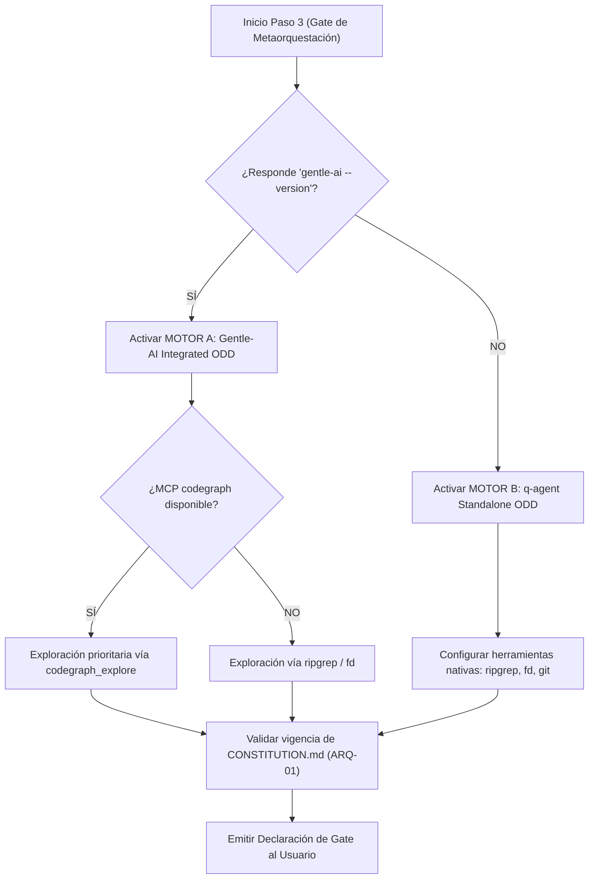

# Arquitectura de Motor Dual (Dual-Engine Protocol)
> Documento de Referencia Técnica — Orquestador q-agent v2.0
> Ubicación: `<SKILL_ROOT>/references/dual-engine.md`

---

## 1. Motivación y Principio de Resiliencia

Un orquestador de nivel Senior no puede depender ciegamente de un solo runtime o CLI de herramientas. Si las utilidades de un ecosistema específico (`gentle-ai`, MCPs propietarios) no están disponibles en la máquina o contenedor de ejecución, el agente no debe colapsar ni degradar la calidad del código producido.

**q-agent v2.0** introduce el **Protocolo de Motor Dual**:
- Capacidad de integrarse al 100% con el ecosistema **Gentle-AI** si está presente.
- Capacidad de operar de forma 100% autónoma en modo **q-agent Standalone** si el entorno es estándar o carece de herramientas avanzadas.
- **Ambos motores obedecen exactamente la misma Constitución (`CONSTITUTION.md`) y el Artículo ARQ-01.**

---

## 2. Comparativa de Motores

| Dimensión | Motor A: Gentle-AI Integrated ODD | Motor B: q-agent Standalone ODD |
|---|---|---|
| **Condición de Activación** | `gentle-ai --version` responde en el host. | `gentle-ai` no detectado / entorno estándar. |
| **Ruta de Bitácora Viva** | `odd/tasks/{{FEATURE_NAME}}.md` | `q-tasks/{{FEATURE_NAME}}.md` |
| **Memoria Persistente** | Memoria Engram (`mem_current_project`, `mem_save`) | Markdown local / Flight Recorder append-only |
| **Exploración de Código** | MCP `codegraph_explore` / Grafo semántico | `ripgrep` (`rg`), `fd`, `git log` nativos |
| **Revisión de Calidad** | Switch de usuario `gentle-ai review mode` | `q-audit-readonly` + `q-ci-fixer` interno |
| **Heurística de Tareas** | ~400 líneas / unidad coherente | ~400 líneas / unidad coherente |
| **Gate de Verificación** | Terminal Evidence Gate obligatorio | Terminal Evidence Gate obligatorio |
| **Gobernanza Suprema** | **CONSTITUTION.md (Artículo ARQ-01)** | **CONSTITUTION.md (Artículo ARQ-01)** |

---

## 3. Protocolo de Detección en Paso 3 (`P03_gate_metaorquestacion.md`)

---

## 4. El Núcleo Inmutable: Gobernanza Constitucional Común

Independientemente del motor que gestione la bitácora o las herramientas auxiliares, el código resultante debe ser indistinguible en calidad y estructura, cumpliendo las 6 cláusulas del **Artículo ARQ-01**:

1. **Vertical Slices por Defecto:** Módulos cohesivos por funcionalidad (storage, handler, vista). Cero capas pasamanos en operaciones estándar.
2. **Umbral de Dominio Rico:** Arquitectura hexagonal reservada exclusivamente para submódulos con >15 reglas de negocio complejas o máquinas de estado multifase.
3. **Persistencia Pragmática:** Consultas directas sin hidratación redundante. En SQLite: WAL mode, busy_timeout ≥ 5000ms y 1 writer pool.
4. **Higiene de Plantillas:** Prohibido generar HTML dentro de archivos de código. Vistas en archivos `.html` independientes empaquetados nativamente (`//go:embed`, Jinja2, TSX).
5. **Ciberseguridad Mandatoria:** 100% de consultas SQL parametrizadas; auto-escape anti-XSS activo; cero secretos en repositorio.
6. **Anti-Mocking & Evidencia Terminal:** Prohibido dar por completada cualquier tarea sin registrar su ejecución empírica en terminal con código de salida `0`.

---

## 5. Portabilidad e Interoperabilidad

Si un proyecto iniciado en modo Standalone se traslada a un entorno con `gentle-ai`:
- El agente lee la bitácora existente en `q-tasks/` y la sincroniza con `odd/tasks/` si el usuario lo solicita.
- Los reportes generados por `BLUEPRINT.md` y las auditorías CAB-RP 2.0 son idénticos y totalmente compatibles.
