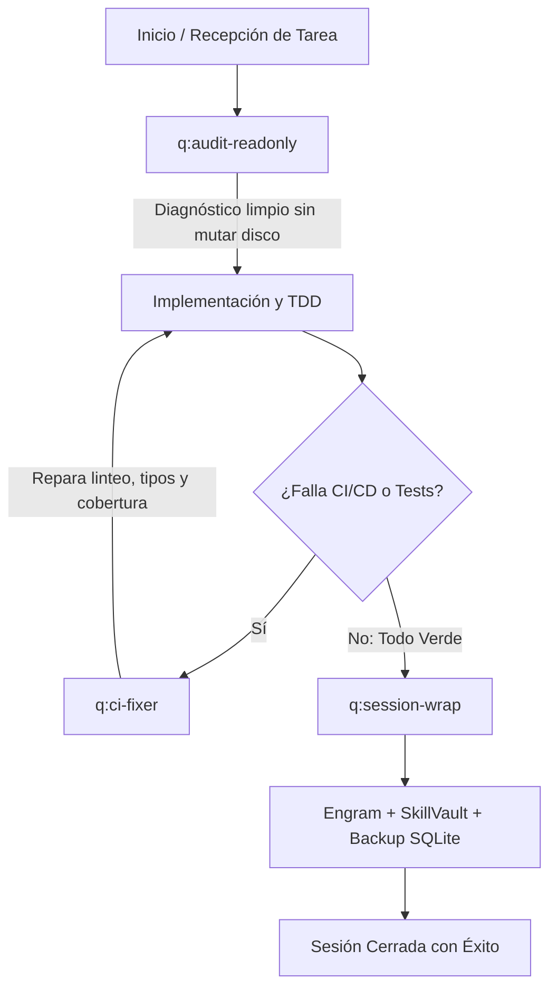

# Quantum Session & Quality Suite (`q-session-quality-suite`)

Suite de habilidades agénticas maestras de **QuantumEdu** para el ciclo de vida de ingeniería de software. Agrupa las tres capacidades operativas más recurrentes identificadas en el historial de sesiones reales de **Engram**: **Auditoría no mutante**, **Auto-reparación de CI/CD** y **Cierre/Respaldo persistente**.

---

## Las Tres Skills de la Suite

| Skill | Slug y Trigger | Propósito Principal | Momento Exacto de Invocación |
|---|---|---|---|
| 🔍 **Auditoría Read-Only** | `q:audit-readonly` `/q-audit-readonly` | Inspección profunda de arquitectura, contratos SDD, frontend y APIs garantizando cero modificaciones en disco. | **Al inicio o recepción de código**: Al llegar a un repo brownfield, antes de refactorizar o al auditar si una tarea marcada como `[x]` realmente funciona. |
| 🛠️ **CI/CD Quality Fixer** | `q:ci-fixer` `/q-ci-fixer` | Diagnóstico y reparación quirúrgica de errores en linters (ruff, eslint), tipos (pyright, tsc) y suites de tests. | **Durante el desarrollo / PR**: Cuando GitHub Actions o un pre-commit falla por formato, tipado, aserciones o caída de cobertura. |
| 📦 **Session Wrap & Backup** | `q:session-wrap` `/q-session-wrap` | Síntesis ejecutiva de la sesión, persistencia de memoria en Engram, catalogación en SkillVault y snapshot SQLite. | **Al cierre de la sesión**: Antes de decir "terminamos", al cerrar una jornada o tras completar un hito significativo de trabajo. |

---

## El Ciclo de Vida Integrado: De Principio a Fin

---

## 1. Momento de Uso: `q:audit-readonly`
### ¿Cuándo activarla?
* Te asignan un repositorio existente (brownfield) y debes entender su estado real antes de escribir una sola línea de código.
* El usuario pide: *"Revisa el proyecto X sin tocar ningún archivo"* o *"Valida si las tareas de spec.md se cumplieron"*.
* Sospechas de "completitudes falsas" (archivos marcados como terminados que en realidad contienen datos simulados o mocks).

### ¿Qué garantiza?
* **Cero mutaciones en disco**: `git status` queda exactamente igual antes y después.
* **CodeGraph primero**: Resuelve dependencias y flujo de llamadas sin escaneos ciegos.
* **Veredicto objetivo**: Clasificación de hallazgos en P1 (bloqueantes), P2 (técnicos) y recomendaciones.

---

## 2. Momento de Uso: `q:ci-fixer`
### ¿Cuándo activarla?
* Acabas de hacer push o ejecutar el runner local y el step de `ruff check`, `pyright`, `pytest`, `jest` o `deno test` arrojó error.
* El pipeline se detuvo por el **Coverage Gate** (ejemplo: la cobertura bajó del umbral requerido del 80% o 90%).
* Hay discrepancias de importaciones desordenadas o errores de sintaxis tras un rebase.

### ¿Qué garantiza?
* **Regla de No Debilitamiento**: Prohibido alterar el `ci.yml` para bajar el porcentaje de cobertura o añadir supresores genéricos (`# type: ignore`, `noqa`) salvo defecto comprobado de la herramienta.
* **Reparación en 4 capas ordenadas**: Linteo -> Tipado estático -> Aserciones de negocio -> Cobertura de ramas.

---

## 3. Momento de Uso: `q:session-wrap`
### ¿Cuándo activarla?
* Has terminado de implementar una feature o corregir un bug y vas a finalizar tu jornada de trabajo.
* El usuario dice: *"Listo, eso es todo por hoy"*, *"Haz un resumen de lo que hicimos"* o *"Cierra la sesión"*.
* Necesitas garantizar que la siguiente sesión (en esta u otra máquina) no empiece "a ciegas".

### ¿Qué garantiza?
* **Persistencia en Engram**: Registro mandatorio de `Goal`, `Instructions`, `Discoveries`, `Accomplished`, `Next Steps` y `Relevant Files`.
* **Catalogación en SkillVault**: La sesión queda registrada en `vault.db` como nota operativa recuperable con `skillvault search`.
* **Respaldo Atómico SQLite**: Ejecución de `VACUUM INTO` para generar una copia limpia sin bloqueos de WAL tanto en `~/.skillvault/exports/` como en `~/backups/`.

---

## Instalación y Compatibilidad en el Sistema

Esta suite es compatible y se encuentra instalada en:
1. **Google Antigravity / Gemini CLI**: `~/.gemini/config/skills/`
2. **Hermes OS**: `~/.hermes/skills/`
3. **Kiro / OpenCode**: Mediante directivas de skill nativas y comandos slash.
